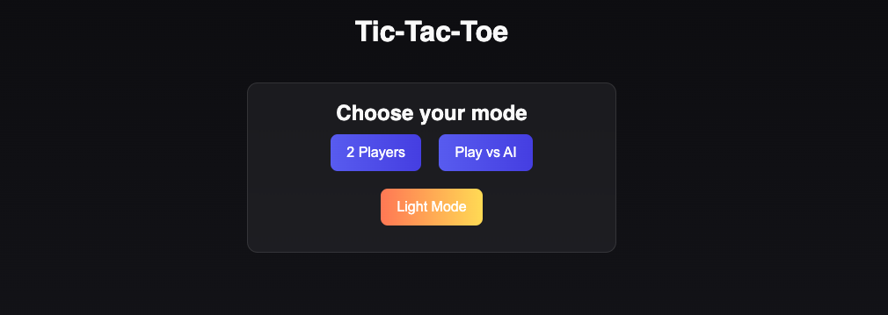

<div id="top"></div>

<div align="center">
  <h3 align="center">🎮 Tic-Tac-Toe</h3>
  <p align="center">
    <a href="#">View Demo</a>
  </p>
</div>



### Built With

* [JavaScript](https://developer.mozilla.org/en-US/docs/Web/JavaScript)
* [HTML](https://developer.mozilla.org/en-US/docs/Web/HTML)
* [CSS](https://developer.mozilla.org/en-US/docs/Web/CSS)

---

## Getting Started

Follow these steps to set up the project locally for development.

#### Setup

1. Make sure you have [Node.js](https://nodejs.org/en/) installed (v14+ recommended).
2. (Optional) Install a simple dev server like [`live-server`](https://github.com/tapio/live-server).

### Installation

1. **Fork the repo**
2. **Clone the repo**
   ```bash
   git clone https://github.com/[YOUR_USERNAME]/[YOUR_FORKED_PROJECT_NAME].git


3.	**Navigate to the project folder**
   ```bash
   cd Tic-Tac-Toe
````

4.	Start a local server `Option A: open index.html directly, Option B: run a dev server`

## npx live-server

5.	Open `http://127.0.0.1:8080` (or the address your dev server specifies) to view the project

<p align="right">(<a href="#top">back to top</a>)</p>


## Usage

1.	Choose 2 Players or Play vs AI.
2.	For AI mode, select difficulty level (`Easy/Medium/Hard`).
3.	Enter player names (optional), choose `Best of X`, and start the game.
4.	Enjoy `Dark/Light` mode toggle and scoreboard tracking via local storage.

<p align="right">(<a href="#top">back to top</a>)</p>


Contributing

Contributions make the open source community an amazing place to learn and create. Any 
contribution you make will be appreciated. 


1.	Fork the repository
2.	Create a feature branch (`git checkout -b feature/new-feature`)
3.	Commit your changes (`git commit -m 'Add some new feature`)
4.	Push to the branch (`git push origin feature/new-feature`)
5.	Open a Pull Request

<p align="right">(<a href="#top">back to top</a>)</p>
